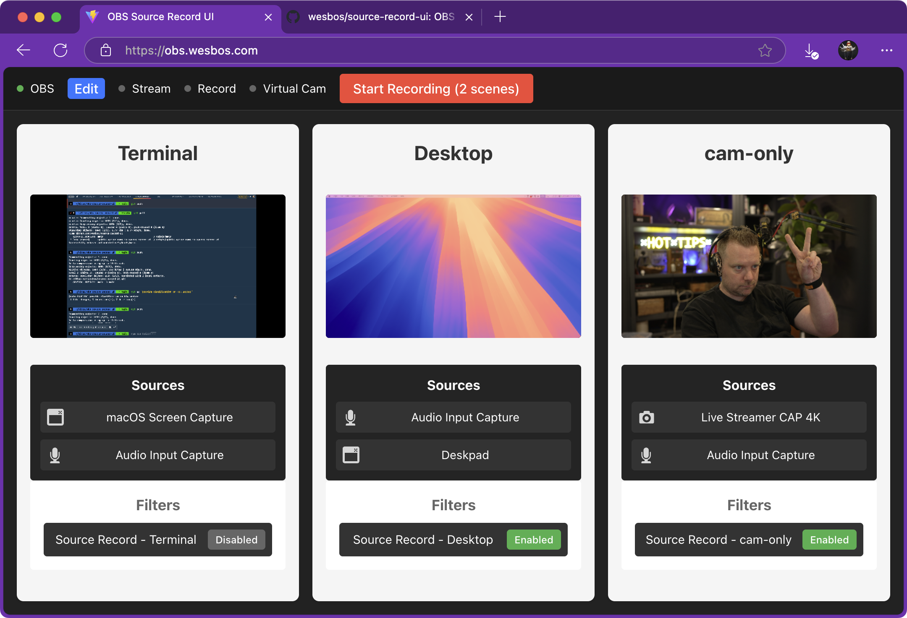

# OBS Source Record UI

Available at [obs.wesbos.com](https://obs.wesbos.com)

OBS source record is great, but the UI for adding filters makes it hard to see what you are really recording.

This project aims to provide:

1. a clear UI for what you are recording - including a realtime stream of all scenes.
2. an easy way to toggle filters on and off
3. buttons to start + stop recording
4. automatic renaming of the files - they should match up to the name of the scene and not overlap others.

## Dev

`npm install` then `npm run dev`.
